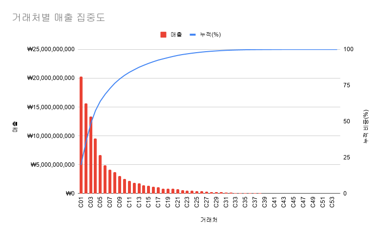
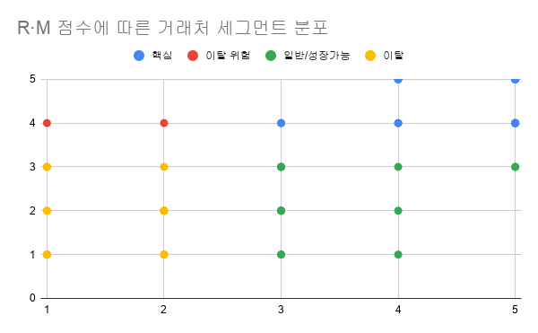

# 어디에 집중할까: 거래처 RFM 세분화와 이탈 방어 우선순위


## 한 줄 소개

실제 기업의 2년 6개월치 매출 데이터(거래처 54곳, 전표 1,351건)를 분석해, 매출 구조를 진단하고 어떤 거래처를 우선 관리해야 하는지 도출한 프로젝트다.

## 핵심 요약

> **결론: 매출의 94%가 20개 거래처에 쏠려 있어, 신규 확보보다 이들의 이탈을 막는 것이 최우선이다.**

**발견**
1. 매출이 소수에 극단적으로 쏠림. 상위 10곳이 82%, 이를 RFM 핵심 세그먼트(20곳)까지 넓히면 94.3%(약 964억)
2. 매출은 등락하나 2년 누적 순증은 약 +3.6%
3. 이탈 위험은 2곳뿐이지만 약 22억 규모로 큼

**제안**
1. 우선순위: 이탈 위험 -> 핵심 -> 일반/성장 -> 이탈
2. 신규 확보보다 **핵심 방어 + 이탈 위험 재활성화**를 우선

**기대 효과**
1. 이탈 위험 2곳(약 22억) -> 놓치면 22억 손실, 살리면 22억 회복 여지로 가장 시급
2. 핵심 20곳(약 964억, 한 곳당 평균 48억) -> 이탈 방어 가치가 큼


## 사용 기술
- MySQL
- Google Sheets

## 분석 과정

매출 구조를 진단하고 관리 우선순위를 도출하기까지 4단계로 진행했다.

### 1단계 EDA (데이터 탐색)
- 데이터 범위 규모 확인 (거래처 54곳 / 전표 1,351건 / 2.5년)
- 데이터 품질 검증: 합계금액 음수 76건 발견 -> 전부 수정세금계산서(정정)임을 확인 -> 순매출 기준으로 집계
- 매출 분포와 연도별 추이 파악

### 2단계 파레토 분석 (매출 집중도)
거래처를 매출 순으로 정렬하고 누적 비중을 계산해 쏠림 정도를 확인했다.
- **상위 10곳이 전체 매출의 82%를 차지** 소수에 극단적으로 집중



### 3단계 RFM 세분화
거래처를 R(최근성), F(빈도), M(매출)로 5등급 점수화한 뒤, 목표(이탈 판단 및 가치 판단)에 직접 대응하는 **R M 기준으로 4개 세그먼트로 분류**했다.
- (F는 M과 상관계수 0.80으로 높아 세분화 기준에서는 제외)
- 결과: 핵심 20곳 / 이탈 위험 2곳 / 이탈 18곳 / 일반 및 성장 14곳



### 4단계 해석 -> 제안
세그먼트별 특성을 바탕으로 관리 우선순위와 세그먼트별 액션을 도출했다.

## 주요 결과
**1. 매출이 소수 거래처에 극단적으로 쏠림**
상위 10곳이 전체 매출의 82%, RFM 핵심 20곳까지 넓히면 94.3%(약 964억)를 차지한다.
- 소수 핵심 거래처의 이탈이 곧 전체 매출의 위험으로 직결된다.

**2. 매출은 등락하나 2년 순증은 미미 (+3.6%)**
상반기 매출 2024년 206억 -> 2025년 192억 (-7%) -> 2026년 214억 (+11.5%).
반등은 있으나 2년 누적 순증은 약 +3.6%로, 뚜렷한 성장보다 완만한 회복에 가깝다. 

**3. RFM 세그먼트 분류 결과**

| 세그먼트 | 거래처 수 | 매출 | 비중 |
| --- | --- | --- | --- |
| 핵심 | 20 | 약 964억 | 94.3% |
| 일반·성장 | 14 | 약 24.8억 | 2.4% |
| 이탈 위험 | 2 | 약 22억 | 2.2% |
| 이탈 | 18 | 약 12억 | 1.2% |

- **핵심**: 매출도 크고 최근성도 높은 그룹 -> 이탈 방어 최우선
- **이탈 위험**: 매출은 크나 최근 거래가 끊긴 예외 -> 재활성화 우선순위 가장 높음

## 제안

**관리 우선순위: ① 이탈 위험 -> ② 핵심 -> ③ 일반 및 성장 -> ④ 이탈**
(이탈 위험은 지금 빠져나가는 중이라 시간 민감성이 가장 높아 최우선)

| 세그먼트 | 전략 | 핵심 액션 |
| --- | --- | --- |
| 이탈 위험 (약 22억) | 재활성화 최우선 | 최우선 접촉 -> 거래 끊긴 원인 파악, 거래 재개 유도 |
| 핵심 (약 964억) | 이탈 방어 | 정기 소통,방문, 마지막 거래일 모니터링으로 이탈 조짐 조기 감지 |
| 일반 및 성장 (약 24.8억) | 육성 | 추가 거래 유도, 핵심 후보로 발전 |
| 이탈 (약 12억) | 저비용, 후순위 | 문자, 일괄 안내 등 최소 비용 접촉 |

### 기대 효과
- 이탈 위험 2곳 (약 22억) 재활성화 -> 사라질 뻔한 **22억 회복 가능**
- 핵심 20곳 (약 964억) 이탈 방어 -> 전체 매출의 **94% 유지**
- **관리 대상을 22곳(핵심 + 이탈 위험)에 집중해 적은 노력으로 매출의 96%를 방어**


## 한계 및 개선 방향

1. **경계값 하드코딩**
   분위 경계값을 Google Sheets에서 구해 SQL에 직접 입력했다.
   -> 향후 고급 SQL 함수를 이용하여 SQL 내에서 동적 계산하도록 개선 예정

2. **작은 표본 크기 (N=54)**
   거래처 54곳을 5등급으로 나누면 등급당 약 11곳이라, 1~2곳 변화에도 분위 경계가 흔들릴 수 있다.
   -> 데이터가 더 축적되면 등급 분류가 안정화된다.

3. **F(빈도) 지표 제외**
   F는 M과 상관계수 0.80으로 높아 세분화 기준에서 제외했으나, 이는 정보 손실을 감수한 선택이다.

## 폴더 구조

```
Project1_RFM_Analysis/
├── README.md              # 프로젝트 개요 (현재 문서)
├── data/                  # 원본 데이터
│   └── sales_data_v2.csv
├── sql/                   # 분석 쿼리
│   ├── Project1_EDA.sql   # EDA 쿼리
│   └── Project1_RFM.sql   # RFM 점수화·세그먼트 쿼리
├── results/               # 쿼리 실행 결과 (R·F·M·RFM 점수)
└── image/                 # 분석 차트 (파레토, RM 산점도)
```


## 상세 버전

전체 분석 과정(EDA, RFM 점수화 기준, 세그먼트별 상세 및 모든 쿼리)은 Notion에서 확인할 수 있다.

**[Notion에서 전체 보기](https://hurricane-poultry-5ea.notion.site/RFM-354ea374812d8036b8b0e1569966b54d)**
